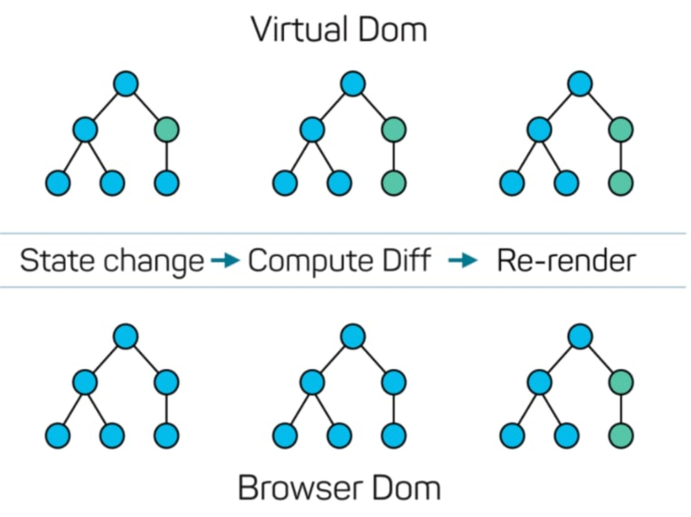

# React List Key

> 우리는 리액트를 통하여 컴포넌트를 구현할 때, 배열 타입의 데이터로 유사한 형태의 컴포넌트를 반복하는 경우가 있다.

```jsx
import "./App.css";

function Item({ person }) {
  return <li>{`${person.first_name} ${person.last_name}`}</li>;
}

function App() {
  const peopleList = [
    {
      id: 1,
      first_name: "Kelcey",
      last_name: "Eckels",
    },
    {
      id: 2,
      first_name: "Corie",
      last_name: "Carman",
    },
    {
      id: 3,
      first_name: "Averell",
      last_name: "Skupinski",
    },
  ];

  return (
    <>
      <h1>Rendering Lists</h1>
      <ul className="list">
        {peopleList.map((item) => (
          <Item person={item} />
        ))}
      </ul>
    </>
  );
}

export default App;
```

* `peopleList` 배열 데이터에 `map` 메서드를 이용하여 `<Item person={item} />` 컴포넌트를 반복하고 있다.&#x20;
* `Item` 컴포넌트에는 `person` 이라는 `props` 이름으로 `peopleList` 의 배열 요소들을 하나씩 전달해 주고 있다.
* 이렇게 하여 `<Item person={item} />` 컴포넌트를 3번 작성하지 않아도 세 개의 컴포넌트를 구현할 수 있다.&#x20;
* 또한 `peopleList` 의 값이 변함에 따라서 `<Item person={item} />` 컴포넌트를 작성해 주지 않아도 알아서 추가, 삭제, 변경된 컴포넌트가 알아서 적용된다.
* 하지만 화면을 띄우게 된다면 우리는 예상하지 못한 에러를 발견하게 된다.

<figure><figcaption></figcaption></figure>

* 각 개의 `<Item person={item} />` 에 고유의 키 `prop` 을 부여해 주어야 한다는 에러이다.


왜 리액트는 우리는 키값을 요구할까?

이를 이해하기 위해서는 가상돔(Virtual DOM)을 이해할 필요가 있다.

1. 우선 리액트의 가상돔은 메모리에 있는 자바스크립트의 객체 형태의 자료형태이다.(가볍다)
2. 실제돔을 검색하고, 추가 삭제 수정 하는 일은 느리고 비싼 작업이다.


<figure><figcaption></figcaption></figure>

* 상태(State)가 변화하면 리렌더링이 일어난다. 이 과정에서 새로운 가상돔이 생겨나고 이 가상돔은 이전의 가상돔과 비교를 통하여 어떤 엘리먼트들이 변화가 되었는지를 파악한다.
* 그리고 이를 통해 알아낸 엘리먼트부분들만 ReactDOM 라이브러리를 통해서 실제돔에 한번에 반영한다. 위 도식에서 2개의 엘리먼트에 변화가 일어나도, 리액트는 2번 반복하여 적용하는게 아니라 집단화 과정을 통해 한번에 업데이트 한다.


고유한 키값은 기존 가상돔과 변경후 가상돔의 비교에서 엘리먼트들의 일치 여부를 확인하는데 도움이 된다.



키 값이 없는 상태에서 데이터가 변경되었다면?

데이터가 한개만 추가되었거나, 한개만 삭제되었거나, 한개만 수정되었다고 해도

리스트 엘리먼트 모두는 변경되었다고 생각할 것이다.



#### 키들은 자식들에서만 적용되는 것이기 때문에, 전역적으로 고유한 키값을 줄 필요는 없다.

그렇다면 인덱스로 키값을 줘도 되겠네? ❌ (에러는 발생하지 않지만, 최적화에 도움이 되지 않는다.)



인덱스로 키값을 주게 된다면...

단순하다. 만약에 중간에 어떠한 배열의 요소를 삽입하거나 삭제한다면...

키값이 변경되면서 재조정시 모두 변경되었다고 생각할 것이다.

이와 마찬가지로 Math.random() 같은 값을 주어도 안된다.


